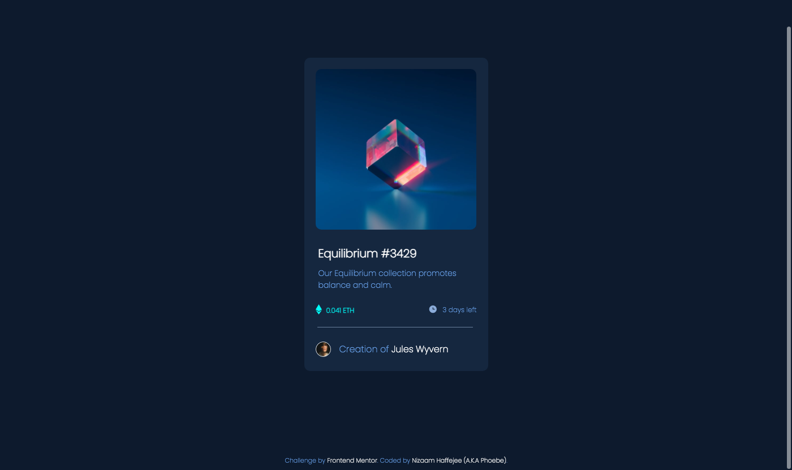

# Frontend Mentor - NFT preview card component solution

This is a solution to the [NFT preview card component challenge on Frontend Mentor](https://www.frontendmentor.io/challenges/nft-preview-card-component-SbdUL_w0U). Frontend Mentor challenges help you improve your coding skills by building realistic projects.

## Table of contents

- [Overview](#overview)
  - [The challenge](#the-challenge)
  - [Screenshot](#screenshot)
  - [Links](#links)
- [My process](#my-process)
  - [Built with](#built-with)
  - [What I learned](#what-i-learned)
  - [Continued development](#continued-development)
  - [Useful resources](#useful-resources)
- [Author](#author)
- [Acknowledgments](#acknowledgments)

**Note: Delete this note and update the table of contents based on what sections you keep.**

## Overview

### The challenge

Users should be able to:

- View the optimal layout depending on their device's screen size
- See hover states for interactive elements

### Screenshot

**

### Links

- Solution URL: [Add solution URL here](https://your-solution-url.com)
- Live Site URL: [Add live site URL here](https://your-live-site-url.com)

## My process

### Built with

- CSS custom properties
- Flexbox (Inline-Flex to be exact)

### What I learned

Creating a seperate div element for the overlay effect, however that does mean that I had to use transform properties to move the element over the image while setting its position to "absolute".

```html
      <div class="overlay overlayFade">
        <a href="#"></a>
      </div>
```


```css
.overlay 
{
	position: absolute;
	transition: all 0.3s ease-in;
	opacity: 0;
	/* background-color: rgb(1, 248, 240); */
	border-radius: 10px;
}

.container:hover .overlay 
{
	opacity: .45;
}

.overlayFade 
{
    height: 284px;
    width: 282px;
    transform: translateX(21px) translateY(-311px);
    background-color: rgb(1, 240, 240);
}

.view-icon
{
	margin-top: 120px;
	margin-left: 120px;
}
```

### Continued development

I plan to learn frameworks which uses more complex forms of CSS to make it easier to style the overlay.

### Useful resources

- [How to create an image overlay using HTML and CSS by GeeksForGeeks](https://www.geeksforgeeks.org/how-to-create-image-overlay-hover-using-html-css/?ref=rphttps://www.example.com) - This helped me to style the Fade-In overlay for the background colour as well as positioning it.
- [How to create an image overlay icon using HTML and CSS](https://www.geeksforgeeks.org/how-to-create-an-image-overlay-icon-using-html-and-css/https://www.example.com) - This is an amazing article which helped me finally understand how to pull off the overlay and placing an icon image above the overlay without breaking everything.

## Author

- Frontend Mentor - [@Lord-Nickelbottoms](https://www.frontendmentor.io/profile/Lord-Nickelbottomshttps://www.frontendmentor.io/profile/yourusername)
- Twitter - [@The_Ur3an_Myth
